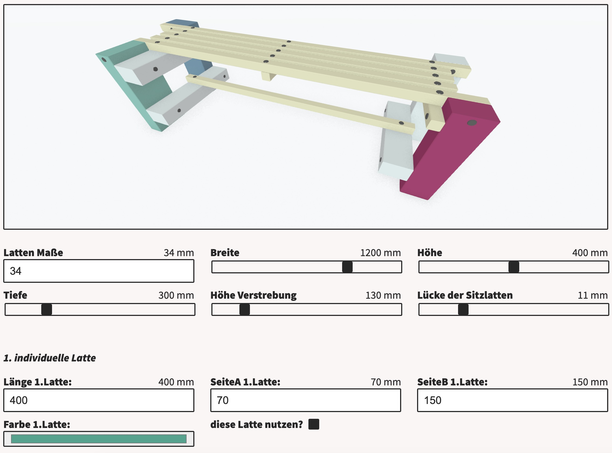
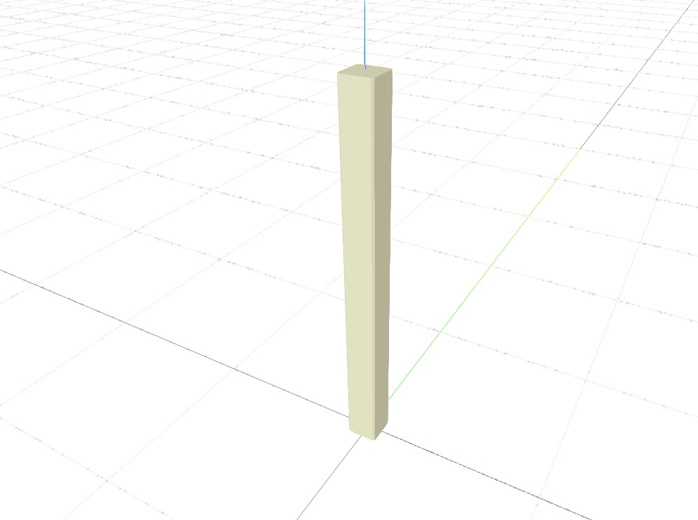
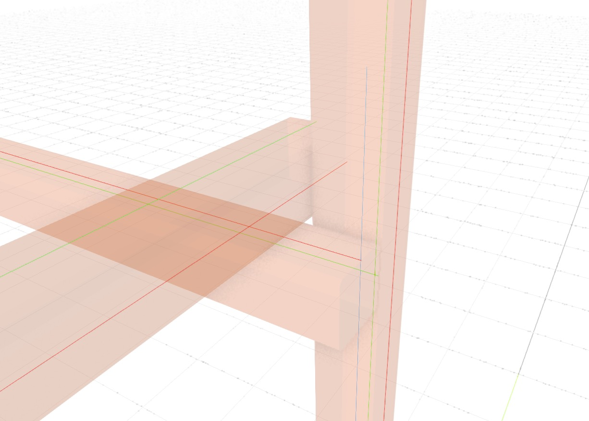
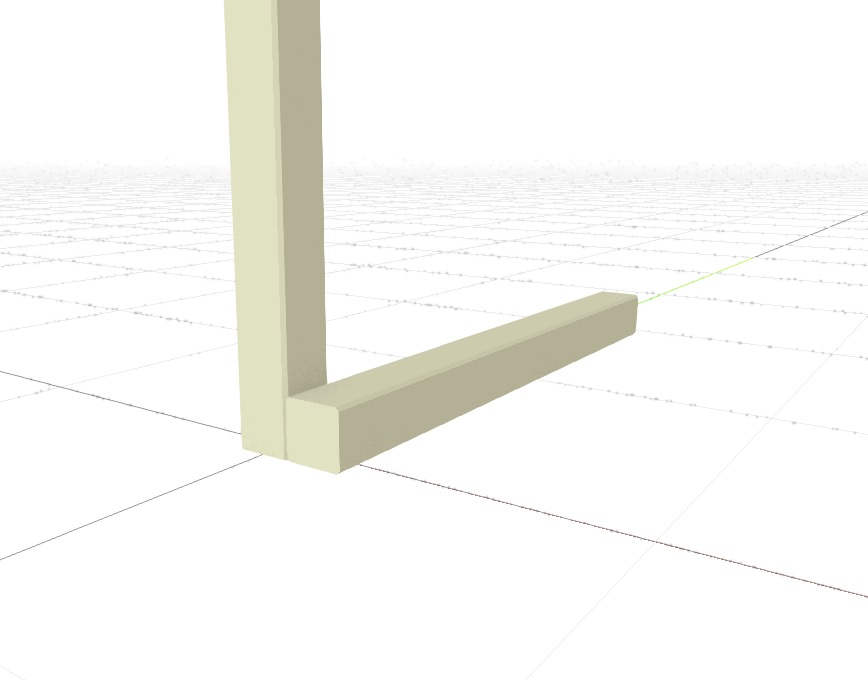
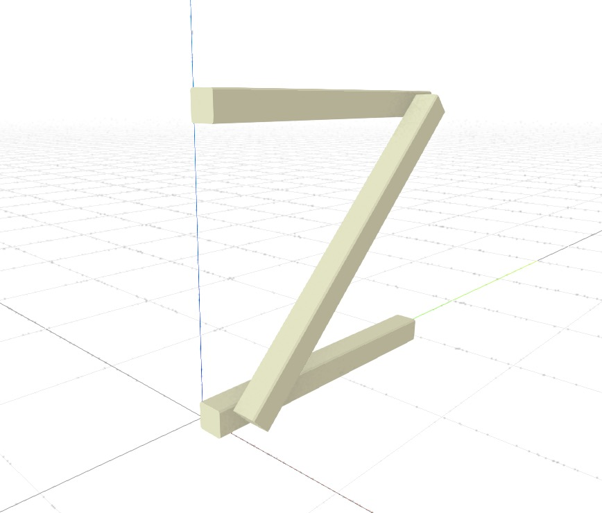
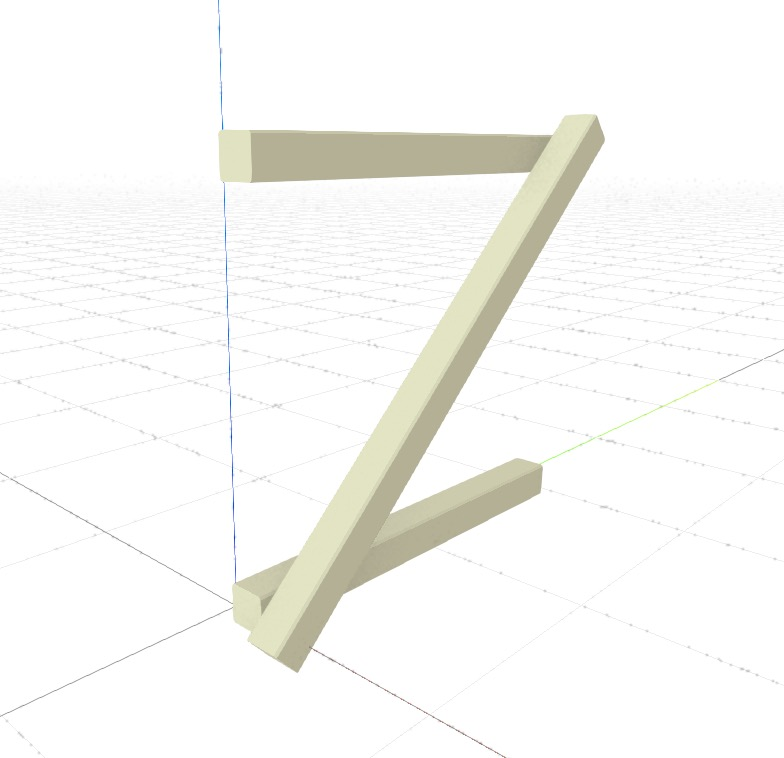
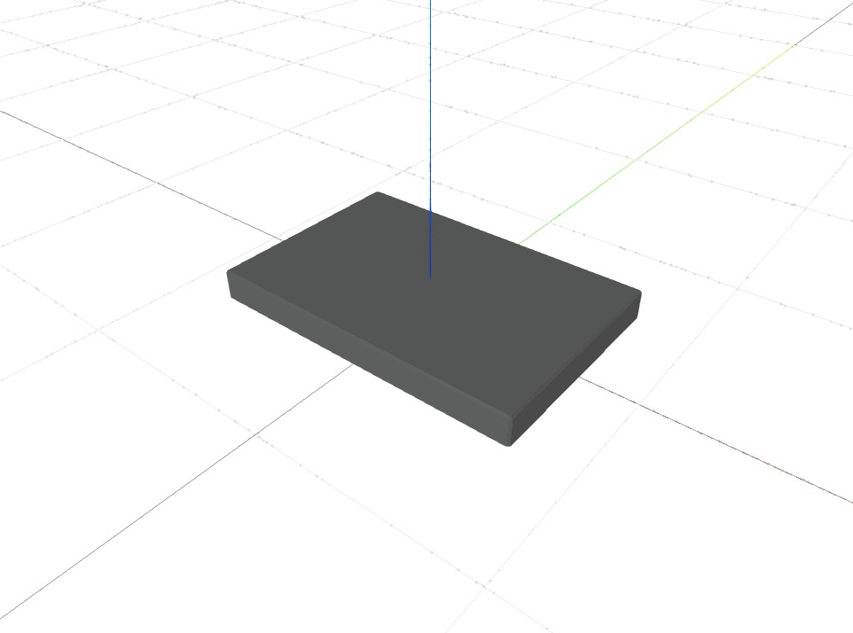

# OPENJOYN Core


## Introduction

Our motivation for the OPENJOYN project is to explore methods of future design and build processes for digital and analog constructions. Therefore a bespoke language based on JavaScript is developed and utilized to parametrically define and customize wood constructions like furniture.


## Our Main Goal

Our vision is to enable common citizens to build individualized wood constructions. In addition to timeless products such as tables and cabinets, current socially relevant constructions can also get integrated. OPENJOYN is intended to develop into a construction catalog for the globally connected society and can achieve a high impact via a potentially large number of users.

By now everyone can access the construction catalog with a work-in-progress web tool we are hosting using the OPENJOYN JavaScript toolkit!

It can be found here: 

[http://openjoyn.milz.studio](http://openjoyn.milz.studio/)




## The toolkit

Besides using the hosted work-in-progress web tool [http://openjoyn.milz.studio](http://openjoyn.milz.studio/) it is possible to utilize the Factory and the toolkit Core in this repo. For details about the functionality please see the [docs](https://openjoyn.milz.studio/dev/docs).


## OPENJOYN CIRCULAR
The "CIRCULAR" module is adding new features to the OPENJOYN tool to give the user a variety of options for using present construction materials. For example, individual bespoke slats can be defined and used in parametric definitions. 

## Examples

In this chapter we have listed some of the most important features to provide a purposeful overview.

### The Factory

Use ***new* Factory()** to create your factory. All the defining and assembling of the construction is done here.

```js
let f = new Factory();
```

### Set global options e.g. defaultsBar

There are plenty of options which can be set for the whole construction. e.g. `f.defaultsBar()`

```js
f.defaultsBar({ size: [34, 34]}); //sets the standard bar size to 34x34mm
```

### Create a bar

A simple bar can be created with [`f.bar](http://f.bar)()` or an axis oriented version with `f.barX()`, `f.barY()`, `f.barZ()`

```js
f.barZ({ position: [0,0,0], length: 400 }); // bar orientated in Z axis
// f.barX({ position: [0,0,0], length: 400 }); // bar orientated in X axis
// f.barY({ position: [0,0,0], length: 400 }); // bar orientated in Y axis
```




### Highlight using debug

The debug option can be set globally in `f.defaultsBar()` and helps to identify flaws during the design process.

```js
f.defaultsBar({ size: [34, 34], debug: true}); //activates debug render mode
```




### Move the coordinate system or move it in grid steps

In order to create in 3d space the push/pop matrix method is used and is combined with `f.move()` and `f.moveGrid()` functions.

```js
f.push();
    f.moveGrid(1, -0.5, 0.5);
		// equivalent (if using 34mm barSize):
		// f.move(34, -17, 17);
    f.barY({ position: [0, 0, 0], length: 400 }); // a Y oriantated baris created at position x=34mm, y=-17mm, z=17mm
f.pop();
```




### Connect two bars point to point

To create a bar with an implizit definition, one can be created with a start and end point. Combined with the .pointFromStart() or/and .pointFromEnd() function, this can be used as the following example illustrates.

```js
f.push();
  f.moveGrid(1,-0.5,0.5);
  let bar1 = f.barY({ position: [0, 0, 0], length: 400 }); // first horizontal bar
  f.moveGrid(0,0,10);
  let bar2 = f.barY({ position: [0, 0, 0], length: 400 }); // second horizontal bar
f.pop();

f.push();
	f.moveGrid(1,0,0);
	f.bar({position: bar1.pointFromStart(30), to: bar2.pointFromEnd(30)}); //third, diagonal bar, start to end
	//f.bar({position: bar1.pointFromEnd(10), to: bar2.pointFromEnd(10)}); //fourth, diagonal bar, end to end
f.pop();
```




### Extend bar on both sides

The f.bar() option "extend" allows to configure an overshoot of the bar at both ends individually.

```js
f.bar({position: bar1.pointFromStart(20), to: bar2.pointFromStart(20), extend: [34, 34]});    

```




### Create a Panel

The factory is also able to create panels, these are defined by size and thickness.

```js
f.panel({position: [0, 0, 0], size: [300, 200], thickness: 30});
```




## License

The OPENJOYN source code is released under the AGPL 3.0


## Special Thanks

Thanks to Prototype Fund & DLR (Deutsches Zentrum für Luft- und Raumfahrt).
Special thanks to [allesblinkt](https://allesblinkt.com/) for supporting the project and its idea! A big shout out to all the other individuals who are involved and thanks for their support!


## Funding

The project was funded by the German Federal Ministry of Education and Research under grant number 01IS21S22 from March to August 2021, and under grant number 01IS22S02 from March to August 2022. The authors are responsible for the content of this publication.


[https://openjoyn.milz.studio](https://openjoyn.milz.studio/)
